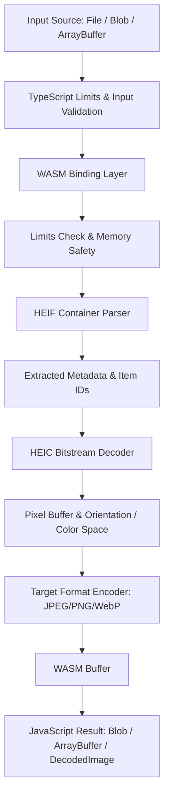

# Architecture

This document describes the architectural layout, crate boundaries, and design principles of `@valen/heic`.

## Guiding Principles

1. **Safety & Robustness First**: Untrusted user inputs must be validated with strict limits before resource allocation.
2. **Predictable Memory Footprint**: In browser environments where memory limits can be strict, avoid uncontrolled allocations or large intermediate copies.
3. **Decoupled Responsibilities**: Keep container parsing, stream decoding, pixel processing, encoding, and WASM bindings isolated in modular crates.
4. **Clean Error Boundaries**: Never panic or leak raw pointer/unstructured errors across the WebAssembly FFI boundary.

---

## Workspace Layout

```
crates/
  heic-core/          Core shared types, Limits abstraction, structured HeicError
  heif-parser/        ISOBMFF box parser, ftyp/meta/iprp parsing, item resolution
  heic-decoder/       Decoder traits and HEVC/HEIC decoding pipeline stubs
  image-processing/   Orientation transforms, color conversions, pixel buffer abstractions
  image-encoder/      JPEG, PNG, and WebP encoders

wasm/                 WASM FFI interface utilizing wasm-bindgen

packages/
  heic/               TypeScript SDK distributed via npm (@valen/heic)
```

---

## Data Flow



---

## Crate Responsibilities

### `heic-core`
- Defines the `Limits` struct containing constraints for file size, dimensions, pixel counts, and memory thresholds.
- Defines `HeicError` and `HeicResult<T>`.
- Houses basic image geometry (`ImageDimensions`, `PixelFormat`, `ColorProfile`).

### `heif-parser`
- Parses ISO Base Media File Format (ISOBMFF) boxes (`ftyp`, `meta`, `hdlr`, `pitm`, `iloc`, `iinf`, `iprp`, `ipma`, `ispe`, etc.).
- Validates brand compatibility (`heic`, `heix`, `mif1`, `msf1`).
- Resolves item references and extracts EXIF / color payload chunks without decoding full image frames.

### `heic-decoder`
- Defines the `HeicDecoder` trait and future HEVC/HEIC tile and frame decoding pipeline.
- Enforces memory allocation thresholds during decompression.

### `image-processing`
- Handles EXIF orientation (1 through 8) geometric transformations.
- Provides RGBA/RGB pixel buffer manipulation abstractions and color profile normalization.

### `image-encoder`
- Defines output encoding traits for converting raw decoded pixel buffers into JPEG, PNG, and WebP formats.

### `wasm`
- Serves as the FFI bridge between JavaScript and the Rust workspace.
- Catches errors and serializes them into typed JavaScript error representations.

### `@valen/heic` (TypeScript)
- Provides ergonomic, idiomatic async APIs (`detect`, `inspect`, `convert`, `decode`).
- Handles polymorphic browser inputs (`File`, `Blob`, `ArrayBuffer`, `Uint8Array`).
- Provides worker orchestration for non-blocking UI operations.
